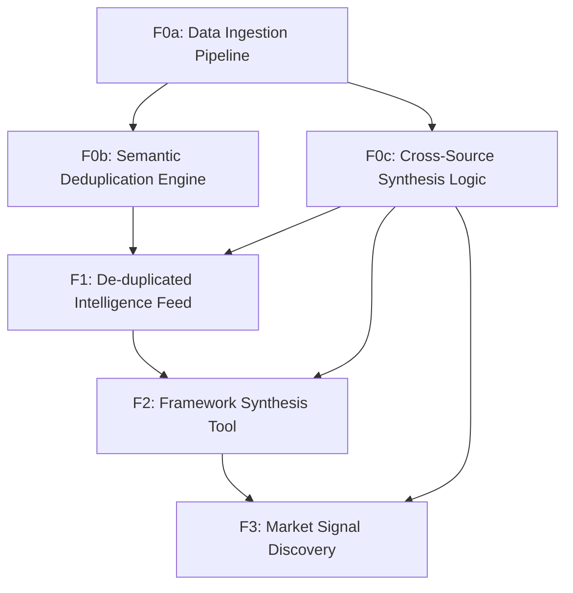

# Feature Map

## Features

| ID | Name | Type | Size | Dependencies |
|----|------|------|------|--------------|
| F0a | Data Ingestion Pipeline | foundation | medium | — |
| F0b | Semantic Deduplication Engine | foundation | medium | F0a |
| F0c | Cross-Source Synthesis Logic | foundation | large | F0a |
| F1 | De-duplicated Intelligence Feed | product | medium | F0b, F0c |
| F2 | Framework Synthesis Tool | product | large | F0c, F1 |
| F3 | Market Signal Discovery | product | medium | F0c, F2 |

## Milestones

### M0: Foundation & Logic Core

**Goal:** Build the core intelligence engine and data pipeline.

**Exit Criteria:**
- Successfully deduplicate 10+ sources into single topics.
- Generate valid cross-source summaries using LangChain and LLMs.

**Features:** F0a, F0b, F0c

### M1: Alpha Release: Unified Intelligence Dashboard

**Goal:** Deliver the user-facing synthesis dashboard and market discovery tools.

**Exit Criteria:**
- User can view side-by-side technical framework comparisons.
- Dashboard displays de-duplicated market signals with zero redundancy.

**Features:** F1, F2, F3

## Dependency Graph

